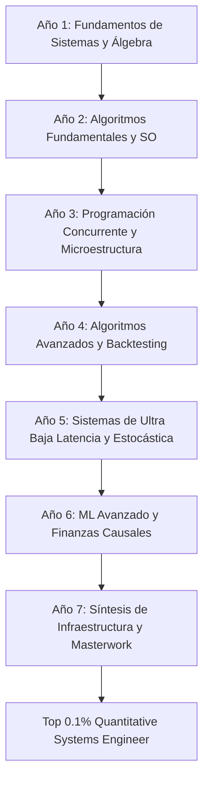

# 🎓 Master Curriculum: Quantitative Systems Engineering (7-Year Ph.D. Track)

Este documento define la estructura y el plan de estudios maestro de **7 años** diseñado para alcanzar la excelencia técnica y matemática equivalente a un doctorado (*Ph.D.*) en Ingeniería de Sistemas Cuantitativos, adaptado a un presupuesto de **8.5 horas semanales** de estudio deliberado.

---

## 🗺️ Mapa de Ruta General (7 Años)

---

## 📅 Desglose de la Campaña de 7 Años

---

### 🛡️ Año 1: Fundamentos de Sistemas y Álgebra (El Concreto)
*   **Enfoque Teórico (Lunes a Viernes)**: Representación de información a nivel de bit, x86-64 básico, direccionamiento, y geometría de espacios vectoriales lineales.
*   **Enfoque Práctico (Sábado)**: Compilación manual de programas, manipulaciones de punteros, y control estricto de memoria en C y Rust.
*   **Textos Core**:
    *   *Computer Systems: A Programmer's Perspective (CS:APP)*, 3rd Edition (Capítulos 1 a 4).
    *   *Introduction to Linear Algebra*, 6th Edition (Gilbert Strang, Capítulos 1 a 4).
    *   *The Rust Programming Language*, 2nd Edition (Capítulos 1 a 5).
*   **Pocket Guides de Apoyo**: *Linux Pocket Guide*, *C Pocket Reference*, *Linear Algebra Done Right* (Capítulos 1 a 3).
*   **Hito Práctico (La Forja)**:
    *   **Proyecto**: Conversor de formatos de datos a nivel binario en C y Rust (`Y1Q1_E02_d2h` y emulador de enteros).
    *   **Portafolio (Paper de Réplica)**: Redactar un paper en LaTeX detallando el impacto del orden de los bytes (*endianness*) en el rendimiento de la CPU.

---

### 🛡️ Año 2: Algoritmos Fundamentales y Sistemas Operativos (Complejidad y Gestión)
*   **Enfoque Teórico**: Complejidad asintótica, estructuras de datos lineales y árboles, virtualización y concurrencia de hilos/procesos a nivel de kernel.
*   **Enfoque Práctico**: Implementación desde cero de listas enlazadas, colas con prioridades y árboles de búsqueda balanceados; llamadas al sistema en Linux.
*   **Textos Core**:
    *   *Introduction to Algorithms (CLRS)*, 4th Edition (Capítulos 1 a 15: Estructuras básicas, ordenamientos, programación dinámica y algoritmos ávidos).
    *   *Operating Systems: Three Easy Pieces (OSTEP)*, Versión 1.10 (Sección de Virtualización y Concurrencia básica).
    *   *Introduction to Linear Algebra*, 6th Edition (Capítulos 5 a 8: Autovalores, SVD y Transformaciones Lineales).
*   **Pocket Guides de Apoyo**: *Grokking Algorithms* (2da Edición), *Linear Algebra Done Right* (Capítulos 4 a 6).
*   **Hito Práctico (La Forja)**:
    *   **Proyecto**: Implementación de un asignador dinámico de memoria personalizado (`malloc` y `free` personalizados) en C.
    *   **Portafolio (Paper de Réplica)**: Redactar en LaTeX un análisis de complejidad asintótica y comparación empírica de rendimiento de 5 algoritmos de ordenamiento bajo diferentes arquitecturas de caché.

---

### 🛡️ Año 3: Programación de Sistemas, Sockets y Microestructura (Los Protocolos)
*   **Enfoque Teórico**: APIs de sockets de red en Unix, protocolos de intercambio de información financiera, microestructura empírica y probabilidad formal.
*   **Enfoque Práctico**: Creación de servidores TCP/UDP altamente concurrentes utilizando C++ y Rust.
*   **Textos Core**:
    *   *Unix Network Programming, Vol. 1*, 3rd Edition (Stevens, Capítulos 1 a 8).
    *   *Trading and Exchanges: Market Microstructure*, 1st Edition (Larry Harris).
    *   *A First Course in Probability*, 10th Edition (Sheldon Ross).
*   **Pocket Guides de Apoyo**: *Beej's Guide to Network Programming*, *C++ Pocket Reference*, *Harvard Stat 110*.
*   **Hito Práctico (La Forja)**:
    *   **Proyecto**: WebSocket cliente en Rust de alto rendimiento que consume y decodifica las estructuras de datos binarias de un mercado en tiempo real de Solana.
    *   **Portafolio (Paper de Réplica)**: Redactar un paper técnico sobre los modelos de selección y propagación de precios ante asimetrías de información y trading informado.

---

### 🛡️ Año 4: Algoritmos Avanzados y Motores de Backtesting (La Velocidad - Parte 1)
*   **Enfoque Teórico**: Teoría de grafos, flujos de red, optimización de matrices, estimación de volatilidad y algoritmos de bajo nivel.
*   **Enfoque Práctico**: Diseño de simuladores de mercado discretos eficientes y optimización matemática multihilo.
*   **Textos Core**:
    *   *Introduction to Algorithms (CLRS)*, 4th Edition (Capítulos 16 a 26: Grafos, flujo en redes y estructuras avanzadas).
    *   *Introduction to Linear Algebra*, 6th Edition (Capítulos 9 a 12: Álgebra lineal numérica, probabilidad y estadística).
*   **Pocket Guides de Apoyo**: *Effective Rust* (Reid), *Algorithms Illuminated* (Volúmenes 3 y 4).
*   **Hito Práctico (La Forja)**:
    *   **Proyecto**: Motor de *Backtesting* modular de latencia simulada y análisis de deslizamiento (*slippage*) de órdenes en Rust y Python/Polars.
    *   **Portafolio (Paper de Réplica)**: Redactar en LaTeX una réplica formal del algoritmo de flujo máximo (*Max-Flow*) optimizado con paralelismo SIMD aplicado a enrutamiento de órdenes.

---

### 🛡️ Año 5: Sistemas de Ultra Baja Latencia, Kernel Bypass y Estocástica (La Velocidad - Parte 2)
*   **Enfoque Teórico**: Optimización a nivel de hardware de CPU (predicción de saltos, fallos de caché), redes con kernel bypass (DPDK), cálculo estocástico para finanzas.
*   **Enfoque Práctico**: Implementación de buffers circulares *lock-free* y medición de latencias con resolución de nanosegundos (registro `rdtsc`).
*   **Textos Core**:
    *   *Systems Performance*, 2nd Edition (Brendan Gregg).
    *   *Stochastic Calculus for Finance I \& II* (Steven Shreve).
    *   *Volatility Trading* (Euan Sinclair).
*   **Pocket Guides de Apoyo**: *DPDK Reference Guides*, manuales de optimización de Agner Fog.
*   **Hito Práctico (La Forja)**:
    *   **Proyecto**: Receptor de datos de mercado multicast con encolamiento *lock-free* y enrutamiento en sub-microsegundos utilizando DPDK y C++.
    *   **Portafolio (Paper de Réplica)**: Redactar y publicar en formato arXiv un reporte técnico que compare la latencia e histéresis de sistemas de cola basados en mutex frente a arquitecturas *lock-free*.

---

### 🛡️ Año 6: Machine Learning Avanzado y Finanzas Causales (El Edge)
*   **Enfoque Teórico**: Machine learning adaptado a series de tiempo financieras sin caer en sobreajuste, descubrimiento causal en mercados y filtros estadísticos.
*   **Enfoque Práctico**: Extracción de características no lineales y optimización de portafolios a partir de variables causales.
*   **Textos Core**:
    *   *Advances in Financial Machine Learning*, 1st Edition (Marcos López de Prado).
    *   *Causality and Factor Investing: A Primer* (Marcos López de Prado, 2023).
    *   *Algorithmic Trading: Winning Strategies* (Ernie Chan).
*   **Pocket Guides de Apoyo**: *Machine Learning for Asset Managers* (López de Prado, 2020).
*   **Hito Práctico (La Forja)**:
    *   **Proyecto**: Motor de predicción de volatilidad implícita y señales de arbitraje temporal mediante filtros de Kalman estructurado en Rust.
    *   **Portafolio (Paper de Réplica)**: Redactar un artículo de investigación detallando el comportamiento de modelos causales aplicados a la microestructura del libro de órdenes.

---

### 🛡️ Año 7: Arquitectura de Datos y Masterwork Synthesis (La Síntesis)
*   **Enfoque Teórico**: Diseño de sistemas distribuidos tolerantes a fallos, consistencia de datos, y co-localización en bare-metal.
*   **Enfoque Práctico**: Integración final de toda la infraestructura desarrollada a lo largo del Ph.D.
*   **Textos Core**:
    *   *Designing Data-Intensive Applications*, 1st Edition (Martin Kleppmann).
    *   **Hito de Código Abierto**: Contribuir activamente y de forma comprobada al core de un proyecto del ecosistema libre (ej. cliente `reth` en Ethereum, `solana-labs`, o bibliotecas de red en Rust como `tokio`).
*   **Hito Práctico (La Forja - Capstone Final)**:
    *   **Proyecto (Tesis)**: **Sistema de Operación de Ultra Baja Latencia de Extremo a Extremo** que integra: ingestión de mercado multicast, decodificación binaria en caliente, validación de riesgos en hardware aislado, ejecución y logueo de auditoría con estampa de tiempo mediante CPU `rdtsc` a nivel de nanosegundos.
    *   **Portafolio (Paper de Ph.D.)**: Redacción y defensa (en formato de publicación abierta) del reporte técnico general del sistema final, validando experimentalmente su perfil de latencia y robustez de red frente a fluctuaciones extremas de volatilidad.

---

## 🏛️ Reglas Académicas de Evaluación Cuatrimestral

1.  **El Compromiso del Paper de Réplica**: Al final de cada año académico, es mandatorio escribir un reporte técnico riguroso en formato PDF compilado en LaTeX. Este documento es el testimonio intelectual del avance del portafolio.
2.  **Cuestionarios Cuatrimestrales de Minors**: Al cierre de cada trimestre (semana 16), se programará un cuestionario exhaustivo estructurado en LaTeX que mida formalmente las competencias de los minors (sintaxis de Neovim y traducción técnica en inglés).
3.  **Hito Operativo de Sábados**: Cada sesión de sábado de 3 horas debe generar al menos un commit documentado con pruebas unitarias en la carpeta de `Ejercicios/`. No hay avance teórico los sábados; es puramente empírico y operativo.
