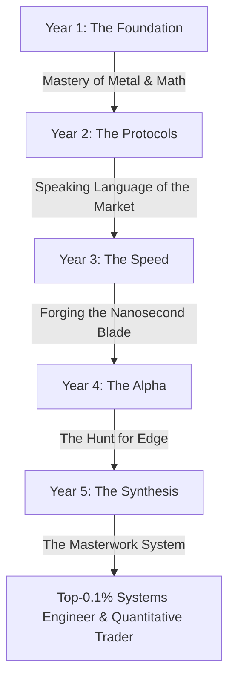

# 🎓 Five-Year Quantitative Systems Engineering Curriculum

This document consolidates the complete five-year learning curriculum and core milestones for the Quantitative Systems Engineering program. Use this as your master roadmap.

---

## 🗺️ Master Curriculum Overview

---

## 📅 Year 1: The Foundation - Humility and Concrete

### 🎯 Mission Dossier
Deconstruct the machine to its essential components—bits, memory addresses, and logic gates—and rebuild your understanding from first principles. Internalize the mathematics of structure and the language of the machine.

### 📋 Core Objectives
*   **Computer Architecture & Systems:** Understand how a program compiles, links, loads, and executes. Master the memory hierarchy, processes, and system calls.
*   **Manual Memory Management (C):** Write, debug, and manage memory in C. Master pointers, allocation (`malloc`/`free`), and data structures.
*   **Linear Algebra:** Think in vector spaces, matrix transformations, and eigenvalues. Solve systems by hand and in code.
*   **Foundational Rust:** Proficiently manage ownership, the borrow checker, structs, enums, and traits.

### 🛠️ The Forge (Capstone Project)
**Limit Order Book (LOB) Matching Engine:**
*   **Phase 1:** Build the matching engine in C to confront raw memory and performance challenges.
*   **Phase 2:** Rewrite the engine idiomatically in Rust to master safety guarantees and compile-time checks.

### 📚 Key Resources
*   *Computer Systems: A Programmer's Perspective (CS:APP)* by Bryant & O'Hallaron.
*   *Operating Systems: Three Easy Pieces (OSTEP)* by Remzi & Andrea.
*   *Introduction to Linear Algebra* by Gilbert Strang (MIT OCW).
*   *The Rust Programming Language* (Official Book).

---

## 📅 Year 2: Systems Programming, Stochastic Processes, & Market Microstructure

### 🎯 Mission Dossier
Shift focus to modern systems programming in C++ and Rust, concurrent programming, basic socket networking, and foundational financial modeling. Introduce formal probabilistic thinking through stochastic processes.

### 📋 Core Objectives
*   Master concurrency, threads, memory safety, and event-driven design.
*   Write high-performance concurrent code using modern C++ (17/20/23) and Rust.
*   Design and implement socket-based networking and event loops (`epoll`).
*   Analyze market microstructure, order flow, execution dynamics, and simulated latency.
*   Model random processes relevant to finance and queuing.

### 🛠️ The Forge (Projects)
*   Basic TCP/UDP echo servers in C and Rust.
*   Event-driven order matching engine with simulated latency.
*   Market replay tool for order flow analysis.
*   Circular buffer and lock-free queue implementations from scratch.
*   Black-Scholes options pricer in C++.

### 📚 Key Resources
*   *Effective Modern C++* by Scott Meyers.
*   *A Tour of C++* by Bjarne Stroustrup.
*   *The Rust Programming Language* by Klabnik & Nichols.
*   *Linux Programming Interface* by Michael Kerrisk.
*   *Beej’s Guide to Network Programming*.
*   *Introduction to Stochastic Processes* by Sheldon Ross.
*   *Trading and Exchanges: Market Microstructure* by Larry Harris.

---

## 📅 Year 3: Financial Engineering, Real-Time Systems, & Infrastructure

### 🎯 Mission Dossier
Transition from isolated components into full-stack financial engineering. Design real-time market data infrastructure, extend your mathematical toolkit with numerical optimization, and begin strategy backtesting.

### 📋 Core Objectives
*   Build a modular real-time backtesting and simulation framework.
*   Apply numerical optimization techniques for model calibration.
*   Design and implement financial indicators, signal engines, and execution logic.
*   Optimize performance at the system level (branch prediction, caching, SIMD).
*   Understand financial derivatives, volatility modeling, and risk metrics.

### 🛠️ The Forge (Projects)
*   Modular backtesting engine with strategy plugins.
*   Real-time market data processor and order book snapshot tool.
*   Execution engine with simulated slippage and P&L tracking.
*   Volatility estimator (historical, implied) with visualization.
*   Risk dashboard tracking live metrics (Sharpe ratio, drawdown, latency histogram).

### 📚 Key Resources
*   *Convex Optimization* by Boyd & Vandenberghe.
*   *Numerical Analysis* by Burden & Faires.
*   *Introduction to Statistical Learning* by James et al.
*   *Options, Futures, and Other Derivatives* by John C. Hull.
*   *Volatility Trading* by Euan Sinclair.
*   *Systems Performance* by Brendan Gregg.
*   *Designing Data-Intensive Applications* by Martin Kleppmann.

---

## 📅 Year 4: Low-Latency Architecture, Signal Research, & Execution

### 🎯 Mission Dossier
Build ultra-low-latency infrastructure, DPDK zero-copy systems, advanced signal engines, and optimize execution layers. Align your stack with production-grade HFT setups.

### 📋 Core Objectives
*   Develop sub-microsecond event-driven systems with nanosecond profiling.
*   Master kernel bypass (DPDK), zero-copy I/O, and hardware time synchronization.
*   Implement signal engines based on time-series analysis, Kalman filters, and spectral analysis.
*   Build a latency-aware order router with venue selection and fallback logic.
*   Analyze market microstructure impact on signal decay and execution risk.

### 🛠️ The Forge (Projects)
*   Nanosecond-resolution logger using CPU `rdtsc` and hardware timers.
*   Multicast market data receiver with lock-free queues.
*   Dynamic execution engine with risk guardrails and throttling logic.
*   Signal engine using moving averages, FFTs, and Kalman filters.
*   Latency-aware order router.

### 📚 Key Resources
*   *DPDK Documentation and Sample Applications*.
*   *Understanding Linux Network Internals* by Christian Benvenuti.
*   *Agner Fog’s CPU Optimization Manuals*.
*   *Time Series Analysis and Its Applications* by Shumway & Stoffer.
*   *Applied Kalman Filtering* by Grewal & Andrews.
*   *Algorithmic and High-Frequency Trading* by Cartea et al.

---

## 📅 Year 5: Full-Stack Trading Architecture & Expert Integration

### 🎯 Mission Dossier
The synthesis. Integrate all previous disciplines—mathematics, systems engineering, research, and execution—into a single production-grade, end-to-end trading system.

### 📋 Core Objectives
*   Architect and implement a full-scale trading system from scratch.
*   Optimize end-to-end latency (ingestion $\rightarrow$ signal $\rightarrow$ risk $\rightarrow$ execution).
*   Simulate co-location constraints, clock sync, and microstructure noise.
*   Deploy live-testing/paper-trading infrastructure on bare-metal.
*   Contribute to major open-source systems/crypto codebases (e.g. `reth`, `solana-labs`, `tokio`).

### 🛠️ The Forge (Master Capstone)
A **Full-stack paper-trading engine** with co-location and latency benchmarking:
*   Real-time market data adapters.
*   Dynamic signal plugin interface.
*   Hardware-isolated risk and throttle engine.
*   Real-time reporting and analytics dashboard.
*   Detailed latency profiles (timestamping every step via `rdtsc`).

### 📚 Key Resources
*   *Designing for Low-Latency* by Herb Sutter.
*   *The Datacenter as a Computer* by Barroso & Hölzle.
*   *Active Quant/HFT research publications* (SIG, Jump, HRT, etc.).
*   *Systemd, Prometheus, and Grafana deployment architectures*.
